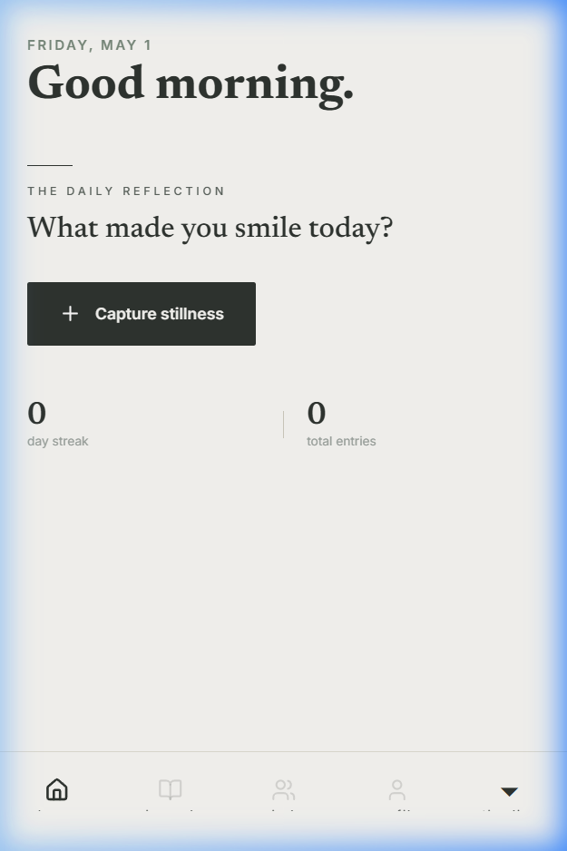
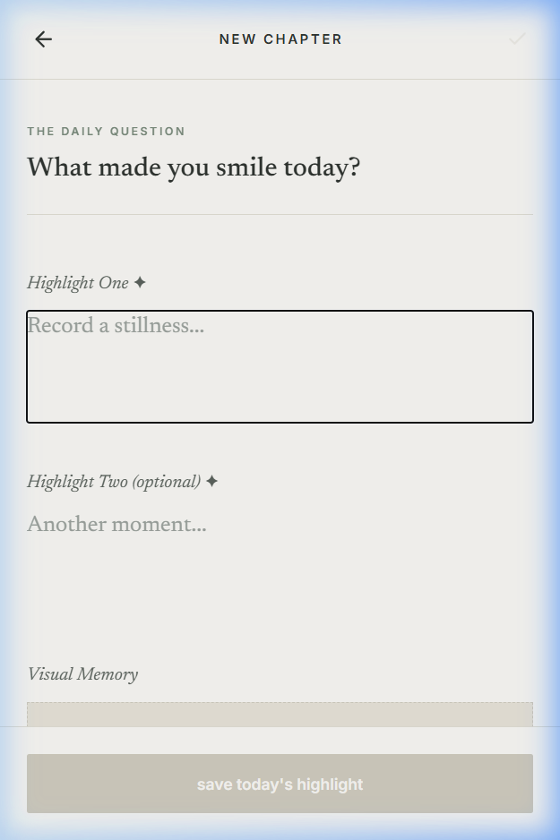
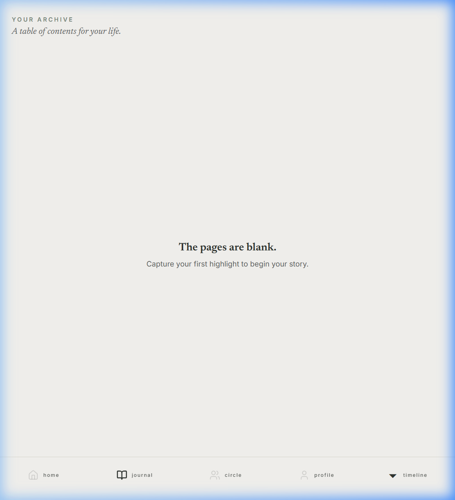
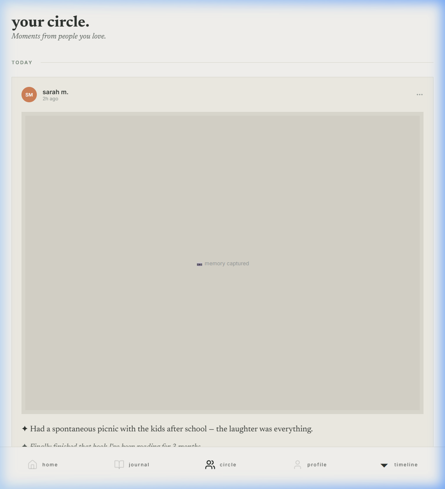

<div align="center">

# 📓 DailyJournal

**A micro-journaling app for capturing the quiet highlights of your day.**

*Built with Expo · React Native · TypeScript*

[Getting Started](#-getting-started) · [Screenshots](#-screenshots) · [Architecture](#-architecture) · [Roadmap](#-roadmap)

</div>

---

## ✨ What is this?

DailyJournal is a cross-platform mobile app that asks you one simple question each day:

> *"What made today meaningful?"*

You write one or two highlights. Attach a photo if you want. That's it.

Over time, your entries become a living archive — a table of contents for your life. The vision is to eventually let you compile your highlights into printed books, share moments with a small circle of family and friends, and resurface memories from years past.

The design philosophy is **"The Curated Stillness"** — an editorial, magazine-like aesthetic that feels more like writing in a physical journal than using a social media app.

---

## 📸 Screenshots

<div align="center">
<table>
<tr>
<td align="center"><strong>Home</strong></td>
<td align="center"><strong>New Entry</strong></td>
<td align="center"><strong>Journal Archive</strong></td>
<td align="center"><strong>Circle Feed</strong></td>
</tr>
<tr>
<td></td>
<td></td>
<td></td>
<td></td>
</tr>
</table>
</div>

---

## 🚀 Getting Started

### Prerequisites

- [Node.js](https://nodejs.org/) (v18+)
- [Expo Go](https://expo.dev/go) on your phone (optional, for mobile preview)

### Run Locally

```bash
# Clone the repo
git clone https://github.com/Luke-Christensen1/DailyJournal.git
cd DailyJournal

# Install dependencies
npm install

# Start the dev server
npx expo start --web
```

The app will open at `http://localhost:8081`.

### Run on Your Phone

1. Install **Expo Go** from the App Store / Google Play
2. Run `npx expo start` in the project directory
3. Scan the QR code with your phone camera
4. The app loads instantly on your device

---

## 🏗 Architecture

```
app/
├── (tabs)/              # Tab-based navigation
│   ├── index.tsx        # Home — daily prompt & recent highlights
│   ├── journal.tsx      # Archive — table-of-contents timeline
│   ├── memories.tsx     # Circle — social feed preview
│   └── profile.tsx      # Profile — stats & settings
├── new-entry.tsx        # Modal — create a new highlight
├── entry/[id].tsx       # Modal — view entry detail
└── _layout.tsx          # Root layout & font loading

constants/
├── colors.ts            # "Loom & Linen" design tokens
└── prompts.ts           # Rotating daily prompts & date helpers

lib/
└── store.ts             # Zustand state management + AsyncStorage
```

### Tech Stack

| Layer | Technology |
|-------|-----------|
| Framework | [Expo](https://expo.dev/) (React Native) SDK 54 |
| Routing | [Expo Router](https://docs.expo.dev/router/introduction/) v3 (file-based) |
| Language | TypeScript |
| State | [Zustand](https://zustand-demo.pmnd.rs/) + AsyncStorage |
| Typography | [Newsreader](https://fonts.google.com/specimen/Newsreader) (serif) + [Inter](https://fonts.google.com/specimen/Inter) (sans) |
| Icons | [Lucide](https://lucide.dev/) |

### Design System — "The Curated Stillness"

| Token | Value | Purpose |
|-------|-------|---------|
| Background | `#FAF9F6` (Bone) | Primary canvas |
| Surface | `#E8E4D9` (Linen) | Cards, inputs |
| Text | `#2F3430` (Charcoal) | Primary typography |
| Accent | `#7A8B7C` (Sage) | Interactive elements |
| Border | `#D1CDC0` (Warm Grey) | Subtle dividers |

---

## 🗺 Roadmap

### Phase 1 — Core Polish *(current)*
- [x] Daily prompt rotation
- [x] Highlight creation & editing
- [x] Photo attachment
- [x] Streak tracking
- [x] Journal archive (table of contents)
- [ ] Push notification reminders
- [ ] Entry search
- [ ] On This Day (memory resurfacing)

### Phase 2 — Social Circle
- [ ] User accounts (Supabase auth)
- [ ] Invite friends by phone number
- [ ] Named circles ("Family", "Close Friends")
- [ ] Reaction system (❤️ 🌟 🫂)
- [ ] Private reply threads

### Phase 3 — The Book
- [ ] Month/year compilation
- [ ] Auto-layout engine
- [ ] PDF export
- [ ] Print-on-demand integration
- [ ] Gift mode (send a book to someone)

### Phase 4 — Intelligence
- [ ] AI-generated weekly summaries
- [ ] "Your summer in highlights" retrospectives
- [ ] Mood pattern recognition
- [ ] Suggested follow-up prompts

---

## 📄 License

This project is private and not yet licensed for public use.

---

<div align="center">
<sub>Built with stillness in mind.</sub>
</div>
